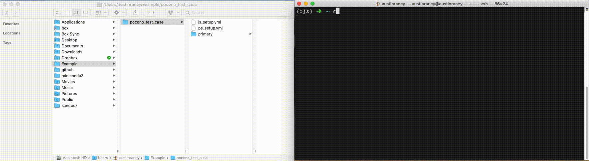
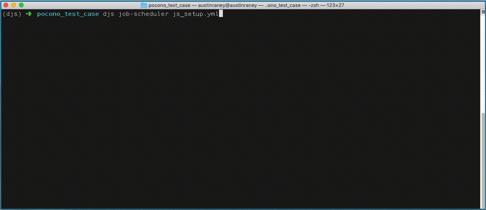

# DJS

DJS is an open-source python library for adjusting parameters and completing concurrent WRF-Hydro/National Water Model simulations. It provides tools that simplify model usage and executions that are operable across operating systems. The framework consists of two main pieces:

- __Perturbation Engine__ for scaling and stochastically generating model parameter sets.
- __Job Scheduler__ for spawning and managing concurrent model simulations.

Most users should utilize DJS's [click](https://github.com/pallets/click) command line interface to access and use the perturbation engine and job scheduler. The CLI takes [yaml](https://yaml.org) input files that tell the perturbation engine and job scheduler what files to work on and how to work on them. See the example and docs for greater detail.

## Installation

Note, if you just want to vary model parameters, you can skip to [package installation](#package-installation).

### Docker

Prior to the package installation, first install [Docker](https://www.docker.com/products). Windows and macOS users should install [Docker Desktop](https://www.docker.com/products/docker-desktop), Linux users should install [Docker Developer Tools](https://www.docker.com/products/developer-tools).

macOS users with [homebrew](https://brew.sh) installed can install Docker as such.

``` bash
brew cask install docker
```

#### Pull the NWM/WRF-Hydro Docker Images

Pull the docker images from docker hub, so DJS can use them to run models. View all available images on [Docker Hub](https://hub.docker.com/u/aaraney).

``` bash
# For NWM version 2.0
docker pull aaraney/nwm-djs:2.0

# For NWM version 1.2
docker pull aaraney/nwm-djs:1.2

# For WRF-Hydro
docker pull aaraney/wrf-hydro:5.1.1
docker pull aaraney/wrf-hydro:5.1.0
docker pull aaraney/wrf-hydro:5.0.3
```

### Package Installation

DJS requires Python 3.5 or higher and is available using `pip`. It's recommend to install DJS into a virtual environment or a conda environment as a best practice. Personally, I think conda is a little easier, but admittedly a little more bloated.

To create a virtual environment run the following in terminal

``` bash
python3 -m venv djs-env

# If on Mac or Linux
source djs-env/bin/activate

# If on Windows
. \djs-env\Scripts\activate
```

To create an environment using conda do the following in terminal. You can [install miniconda here](https://docs.conda.io/en/latest/miniconda.html).

``` bash
conda create --name djs python=3.8
conda activate djs
```

Install DJS using pip

``` bash
pip3 install djs
```

## Example case

Files for this example [NCAR Pocono, PA test case](pocono_test_case/pocono_test_case.zip) can be downloaded and extracted for recreation purposes.

In this example, a set of varied model parameter files will be created and used to run NWM version 2.0 simulations.

### Create varied parameter files

Let's take a look inside `pe_setup.yml` before varying the parameters. Documentation on the perturbation engine yaml setup file can be found by running `djs perturbation-engine --help` or in the docs.

``` yaml
# Perturbation Engine setup yml file
primary/DOMAIN/Route_Link.nc:
  - nCC:
      scalar: '* 1.3'
      output: 'nCC_route_link.nc'
primary/DOMAIN/soil_properties.nc:
  - mfsno:
      uniform: True
      output: 'mfsno_soil_properties.nc'
primary/DOMAIN/Fulldom_hires.nc:
  - OVROUGHRTFAC:
      scalar: '- 0.2'
      output: 'OVROUGHRTFAC_fulldom_hires.nc'
  - multi_group:
      output: 'RETDEPRTFAC_OVROUGHRTFAC_fulldom_hires.nc'
      OVROUGHRTFAC:
          norm: False
          scalar: '- 0.3'
      RETDEPRTFAC:
          scalar: '- 0.05'
```

For those following along navigate to the location you extracted the `pocono_test_case.zip` using the terminal/command prompt.



Create a varied parameter set is as simple as running:

``` bash
djs perturbation-engine pe_yaml.yml
```

Varied parameter files should now exist in the `pocono_test_case` directory.

### Run NWM Simulations

First, ensure that Docker is running. Next, let's take a peak at the Job Scheduler setup files. Documentation on the perturbation engine yaml setup file can be found by running `djs job-scheduler --help` or in the docs.

``` yaml
# Job Scheduler setup yml file
primary: 'primary'
alternative-files:
  - 'nCC_route_link.nc'
  - 'mfsno_soil_properties.nc'
  - 'OVROUGHRTFAC_fulldom_hires.nc'
  - 'RETDEPRTFAC_OVROUGHRTFAC_fulldom_hires.nc'
image: 'aaraney/nwm-djs:2.0'
max-jobs: 2
cpus: '0-2'
mpi-np: 2
```

To start the simulations run:

``` bash
djs job-scheduler js_setup.yml
```



New directories starting with the prefix `rep-` should appear in the `pocono_test_case` directory. These directories hold each of the model simulations.


Contributors: [Austin Raney](mailto:aaraney@crimson.ua.edu), [Iman Maghami](mailto:im3vp@virginia.edu), [Yenchia Feng](mailto:yenchia@stanford.edu)
